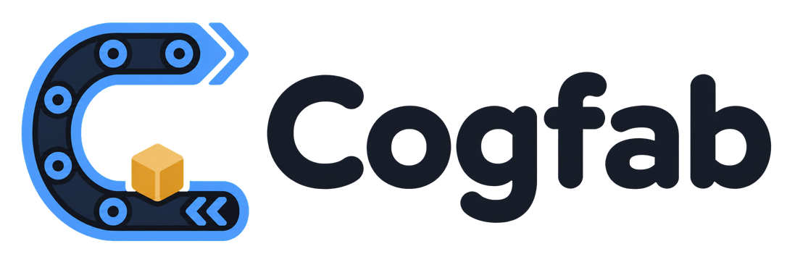

<p align="center">
  <picture>
    <source media="(prefers-color-scheme: dark)" srcset="web/public/brand/cogfab-lockup-light.png">
    <source media="(prefers-color-scheme: light)" srcset="web/public/brand/cogfab-lockup-dark.png">
    
  </picture>
</p>

<p align="center">
  <strong>A real-time multiplayer co-op factory game.</strong><br>
  Build an automated factory together, live in the browser.
</p>

<p align="center">
  <a href="https://cogfab.io"><strong>Play Cogfab</strong></a>
</p>

The URL is the invite link. Open a room, share the address, and up to four
people can build one factory together.


Each room code creates a stable resource world with finite iron, copper, quartz,
and gold deposits. Extractors work on deposits, sellers ship from marked ports,
and delivered resources become shared credits. The buildable region grows from
8x8 to 64x64, revealing rarer and more valuable materials farther from the
starting factory.

Everyone in a room shares the same grid and economy. Live cursors and
color-coded build previews show what every player is about to place. Accepted
buildings appear immediately with a small particle burst. Belts choose straight,
corner, and junction models from the route the material actually follows.

Build previews are temporary presence, not reservations. Dragged buildings
cross the wire as one batch, and the server validates every cell before changing
the grid. If two players overlap, the first valid action wins without leaving a
partial build.

## Why I built it

I built Cogfab to see how far a simple, server-authoritative design can go before
distributed infrastructure is actually useful. The goal is a system I can
explain, test, observe, and operate end to end. Extra services only enter when
the workload earns them.

## Architecture

One Go process hosts every room. Each room owns its grid, players, and economy
on one goroutine, so its hot path needs no locks.

The server applies commands, advances the economy, and owns each deposit's
remaining stock. Clients receive one grid snapshot when they join, then compact
tile, resource, economy, cursor, and build-preview updates. Animation stays in
the browser, keeping per-item positions off the wire and the server focused on
authoritative state.

Builds, rotations, and destroys send only the tiles they changed. In the wire
benchmark, a 64-tile update is 2.7 KB instead of a 127 KB full-world snapshot.
Full snapshots remain the safe path for joins, reconnects, land unlocks,
unusually large batches, and older tabs during deployment.

Local build previews update on every pointer move. Routine shared updates are
coalesced to 20 per second and sent separately from cursor movement, so a long
drag stays responsive without repeatedly broadcasting the whole room roster.

Today, one Container-Optimized OS VM is enough. Rooms already have stable codes
and isolated state. Scaling out would require routing each room code to one
process and moving room saves to shared storage, but the room model itself would
not change.

## Tech stack

| Layer | Choice |
| --- | --- |
| Simulation + server | Go (pure grid engine; room hubs + finite-resource sim; WebSocket server) |
| Transport | WebSockets (`coder/websocket`) |
| Wire format | JSON commands, full join snapshots, and compact world/presence updates (placement batches are atomic) |
| Client | React + TypeScript + Vite |
| Rendering | Three.js via React Three Fiber |
| Audio | Synthesized WebAudio effects plus a looping licensed music track |
| Persistence | Versioned, validated JSON snapshots with rollback-safe migration |
| Observability | Prometheus-format metrics, OpenTelemetry Collector, Cloud Monitoring, Cloud Logging, and a portable Grafana dashboard |
| TLS | the server fetches its own Let's Encrypt certificate |
| Deploy | Small distroless Docker image on one GCP e2-micro COS VM; reference GKE manifests in `deploy/` |
| CI | GitHub Actions: static checks, race-enabled tests, web build, and production container smoke test |
| Delivery | Keyless GitHub Actions deploy through GCP Workload Identity Federation, with health checks and rollback |

## Repository layout

```
cogfab/
├── cmd/server/        game server entrypoint (also serves the built web app)
├── internal/
│   ├── engine/        the pure factory grid (start here)
│   ├── server/        rooms of hubs: world + economy + players per room
│   └── wire/          the JSON messages both directions
├── web/               React + Vite + Three.js client
├── deploy/            COS startup script plus reference GKE manifests
├── Dockerfile         three-stage build to a small distroless image
└── docs/              devlog and the deploy runbook
```

Good places to start:

- `internal/server/hub.go`: one goroutine owns each room.
- `internal/server/worldgen.go`: room codes deterministically seed deposits and ports.
- `internal/server/economy.go`: the resource simulation stays off the wire.
- `internal/server/save.go`: room snapshots migrate, validate, and write atomically.
- `internal/server/bench_test.go`: simulation and wire-payload benchmarks.

## Development

```bash
go test ./...           # server tests (race-safe; CI runs them with -race)
cd web && npm test      # client tests (vitest)
```

Run the game locally (two terminals):

```bash
go run ./cmd/server     # game server on :8080
npm run dev             # in web/, opens the client (usually :5173)
```

Commits follow [Conventional Commits](https://www.conventionalcommits.org/).
Common types and scopes are listed in `.gitmessage`, which can be enabled with
`git config commit.template .gitmessage`.

## Credits

- [Factory Kit](https://kenney.nl/assets/factory-kit) by Kenney, licensed under CC0.
- [Nature Kit](https://kenney.nl/assets/nature-kit) by Kenney, licensed under CC0.
- ["New Direction"](https://uppbeat.io/track/kevin-macleod/new-direction) by Kevin MacLeod, licensed through Uppbeat.

## License

[MIT](LICENSE)
