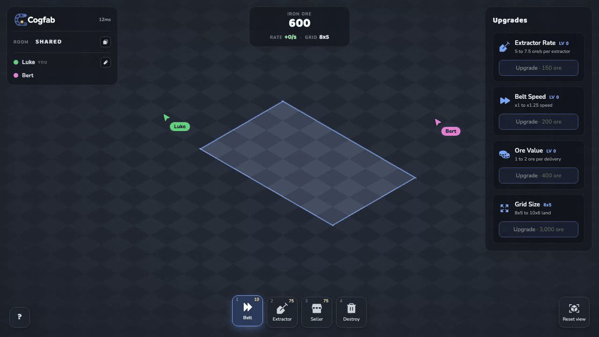
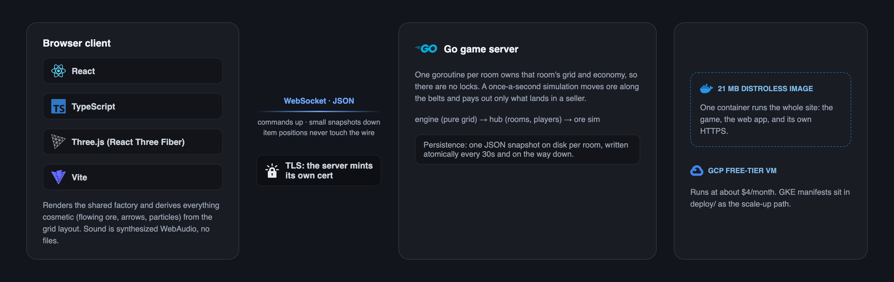

# Cogfab

> Build an automated factory with your friends, live in the browser.

## [Play it at cogfab.io](https://cogfab.io)

No account, no install. Opening the link drops you into your own room, and the URL in the address bar is the invite: send it to up to three friends and you all build the same factory together, watching each other's cursors move around the board.



You start with just enough ore for a first extractor-belt-seller line. Ore that reaches a seller earns, earnings buy upgrades and more land, and more land holds more lines. Everything in a room is shared: the grid, the ore, the upgrades.

## Why this exists

A portfolio project to demonstrate (and defend in depth) real-time netcode, Go concurrency, performance engineering, full-stack development, and cloud deployment, in one cohesive system.

## Architecture



One server process hosts many rooms. Each room is a hub: a single goroutine that owns that room's grid and economy (no locks), applies commands instantly, and runs a once-a-second simulation that moves ore chunks along the belts and pays out only what lands in a seller. Clients get small snapshots plus a handful of economy numbers; everything cosmetic (the flowing ore, the direction arrows, the particles) is derived client-side from the layout, so item positions never touch the wire. Rooms are goroutines, not pods: a room is a few kilobytes ticking in microseconds, so hundreds fit in one process, and scaling out later just means routing each room code to a consistent process.

## Repository layout

```
cogfab/
├── cmd/server/        game server entrypoint (also serves the built web app)
├── internal/
│   ├── engine/        the pure factory grid (start here)
│   ├── server/        rooms of hubs: world + economy + players per room
│   └── wire/          the JSON messages both directions
├── web/               React + Vite + Three.js client
├── deploy/            GKE manifests, the scale-up path
├── Dockerfile         three-stage build to a small distroless image
└── docs/              devlog and the deploy runbook
```

Good places to read: `internal/server/hub.go` (one goroutine per room, no locks), `internal/server/economy.go` (the ore simulation and why it stays off the wire), `internal/server/save.go` (persistence with atomic writes), and `internal/server/bench_test.go` (the benchmark behind a 148ms-to-2ms tick fix).

## Development

```bash
go test ./...           # server tests (CI also runs them with -race)
cd web && npm test      # client tests (vitest)
```

Run the game locally (two terminals):

```bash
go run ./cmd/server     # game server on :8080
npm run dev             # in web/, opens the client (usually :5173)
```

CI runs gofmt, vet, race-enabled tests, the TypeScript typecheck, vitest, and a production build on every push.

**Commit conventions:** [Conventional Commits](https://www.conventionalcommits.org/). Types: `feat fix docs test refactor perf build ci chore`; scopes such as `engine net web deploy docs`. A message template is wired up via `git config commit.template .gitmessage`.

## License

[MIT](LICENSE)
