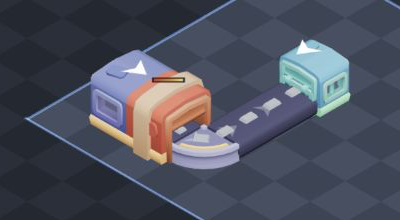

# Refiner

Optional mid-line processing that turns raw ore into higher-value products.

## Loop

Players still ship raw ore extractor → belts → seller for base credits. Routing
through a refiner instead:

```
extractor → belts → refiner → belts → seller
```

pays **3×** the raw sale value after a short processing delay. Refining is never
required, so a first iron line stays simple; the reward is choosing when to spend
space and credits on a refining spine.

## Alignment

The refiner is a straight inline processor, not a one-way gate. Material may
enter from either end of its horizontal or vertical axis and exits from the
other end. There is no input-facing direction to manage.

Place a refiner directly on a straight belt to upgrade that cell in place; it
inherits the belt's routed alignment, so the line stays connected without
destroying and rebuilding the belt first. Corners and junctions remain belts
because the refiner itself is straight.

## Recipes

| Raw    | Product         | Base credits |
| ------ | --------------- | ------------ |
| Iron   | Iron bar        | 1 → 3        |
| Copper | Copper sheet    | 3 → 9        |
| Quartz | Quartz crystal  | 8 → 24       |
| Gold   | Gold ingot      | 20 → 60      |

Sale Value still multiplies the final product.

## Processing

A refiner handles **one job at a time**. Incoming ore waits on the input mouth
until the machine is free, then spends `0.4 / (1 + 0.5 × level)` seconds refining
before the product rides the output belts. Waiting ore keeps its visible belt
spacing and applies backpressure all the way to the extractor, so an overloaded
machine pauses extraction instead of consuming ore into an invisible stockpile.
At upgrade levels beyond the visual density cap, one rendered piece represents
several ore; its processing time grows by the same batch size, preserving the
machine's real ore-per-second capacity instead of granting free throughput.

An untouched extractor and belt line carries 5 ore per second. A new refiner
handles 2.5 of them, so its 3× products raise that line from 1× to **1.5× cash
flow** while consuming the deposit half as quickly. Two Refiner Speed levels
raise capacity to the full 5 ore per second and unlock the complete 3× rate.
The ore always pays 3× over the life of its deposit; Refiner Speed determines
how quickly that value arrives.

Extractor Rate and Belt Speed can push more ore into the line than its refiner
can handle. The tooltip separates ore moving normally inbound from ore actually
stopped in a queue. A growing waiting count is the signal to buy Refiner Speed
or give separate extractor routes their own refiners. Routes that merge into one
refiner share that one machine's capacity, so refining before a merge is the
higher-throughput layout.

A compact gradient bar remains visible above every refiner and fills toward
the next completed item without requiring hover. When a faster refiner is
waiting on its input belt, the bar uses the actual arrival-limited output
cadence instead of pretending the machine is the bottleneck. Hovering still
shows the current recipe or next-output countdown and queue size.

## Upgrade: Refiner Speed

| Level | Process time | Capacity    | Standard-line cash flow |
| ----- | ------------ | ----------- | ----------------------- |
| 0     | 0.40 s       | 2.50 ore/s  | 1.50× raw               |
| 1     | 0.27 s       | 3.75 ore/s  | 2.25× raw               |
| 2     | 0.20 s       | 5.00 ore/s  | 3.00× raw               |
| 5     | 0.11 s       | 8.75 ore/s  | 3.00× raw, plus headroom |

Price starts at **250** credits and doubles each level, matching the other
production upgrades. Buying it still requires a live income line and leaves the
next land unlock reserved. Once a refiner has no queue, another speed level is
headroom for faster extractors, faster belts, or shared routes rather than an
immediate payout. Production upgrades cap at level 40, where the next-price
field becomes zero. Credits saturate at JavaScript's largest exactly
representable integer, so even an extreme late-game room stays stable across
Go, JSON, and the browser.

## Build cost

**150** credits. Placeable on open land (no live deposit, no shipping port), or
directly over an existing straight belt on valid terrain.

At level 0 with untouched Extractor Rate, Belt Speed, and Sale Value:

| Ore    | Raw credits/s | Refined credits/s | Added credits/s | Payback |
| ------ | ------------- | ----------------- | --------------- | ------- |
| Iron   | 5             | 7.5               | 2.5             | 60 s    |
| Copper | 15            | 22.5              | 7.5             | 20 s    |
| Quartz | 40            | 60                | 20              | 7.5 s   |
| Gold   | 100           | 150               | 50              | 3 s     |

Sale Value multiplies the added income too, so established factories recover
the same 150-credit build cost sooner. The flat price keeps raw shipping useful
while credits are scarce, then makes refining increasingly attractive as rarer
deposits open.

## Why it’s fun

- Early game: ship raw to fund the first land choice quickly.
- Mid game: choose faster raw extraction or longer-lived, higher-value refining.
- Upgraded factories must match refiner capacity to incoming belt traffic.
- Co-op: one player opens deposits, another lays the refining spine, a third
  keeps sellers and upgrades fed.
- Separate refiners before routes merge beat one overloaded shared machine.

## Art

The refiner uses the Kenney Factory Kit `machine-fortified.glb`, committed as
`web/public/models/refiner.glb`, over a continuous conveyor. Its ribbed housing
reads as a two-sided processing tunnel: rough ore disappears inside and a
metallic ingot-shaped product emerges on the other side. The extractor and
seller use the kit's windowed machine pieces; the seller adds a scaled
`scanner-low.glb` intake so material visibly travels into the collection unit.
Moving ore uses a custom faceted nugget with a flat contact base, while finished
bars use a separate thin, solid beveled ingot mesh. Both sit directly on the
conveyor surface, and a stopped refiner keeps waiting pieces spaced along the
input belt instead of overlapping them inside one flickering pile.
Role-specific colormaps keep the silhouettes in one visual family while making
their jobs readable at a glance: cool blue for extraction, heat-worn copper and
cream for refining, and mint/teal for shipping. These palettes are derived from
the Factory Kit texture atlas rather than generated artwork.


